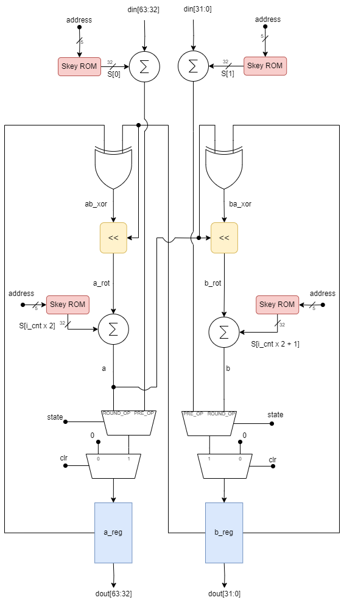

# RTL Design for RC5-32/12/16 Encryption and Decryption

## Overview
This repository contains the RTL (Register-Transfer Level) design implementation and validation for RC5-32/12/16 encryption and decryption. The encryption module is coded in VHDL while the decryption module is implemented in Verilog. Both modules have been rigorously validated using a test bench.

## Design
The design primarily consists of a ROM containing expanded keys and left/right data-dependent rotate components. Architectural diagrams for both encryption and decryption modules are provided in Figure below,

  
  

  <em>a): Encryption Data Path</em> &emsp; <em>b): Decryption Data Path</em>

The design employs Finite State Machines (FSM), with diagrams depicted below,

  
  

  <em>a): Encryption FSM </em> &emsp; <em>b): Decryption FSM</em>

## Test Cases
Test cases for design validation were created using Python, comprising 100 texts and their corresponding encrypted values stored in 'testCases.mem'. Each line in 'testCases.mem' contains the text and its encrypted text. The test bench feeds these inputs into the encryption and decryption modules, comparing outputs against expected values. Successful validation is indicated through results printed in the Vivado Tcl console window.

## Simulation Results
### Data Dependent Left Rotate
Simulation results for encryption and decryption are illustrated in Figures 3 and 4, respectively.

*Figure 3: Encryption simulation result for the first two test cases*

*Figure 4: Decryption simulation result for the first two test cases*

The simulation demonstrates 'dout ready' transitioning high after a few clock cycles post-valid input, indicating output readiness. Both encryption and decryption modules successfully pass all 100 test cases outlined in 'testCases.mem'.

## Summary
- Encryption module: VHDL
- Decryption module: Verilog
- 'testCases.mem': Contains 100 text-cipher pairs for design validation
- Both encryption and decryption modules function as expected, passing all test cases.
